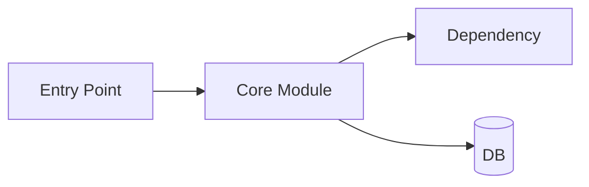
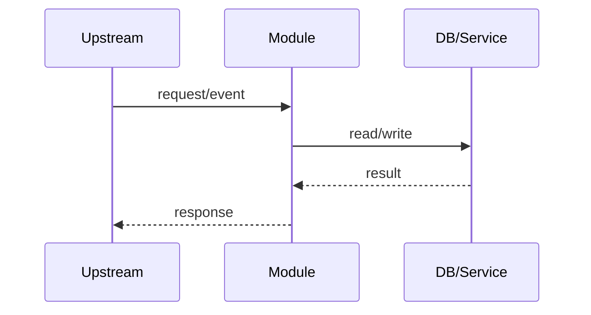
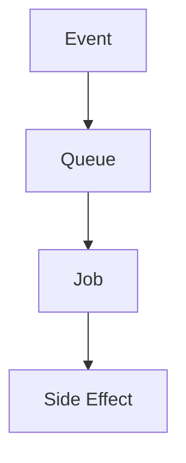

# CONTEXT Template (LLM-First)

Use this file as the baseline structure when generating `<target_folder>/CONTEXT.md`.

# <Domain Name> Context

## Metadata
- Domain:
- Primary audience:
- Last updated: YYYY-MM-DD
- Status: Active
- Stability note: Sections marked `[STABLE]` should change rarely. Sections marked `[VOLATILE]` are expected to change often.

---

## 0. Context Maintenance Protocol (LLM-First) [STABLE]

This file is the primary working context for this domain.

- LLM agents should treat this as a living document and update it whenever meaningful behavior changes.
- If code and this file diverge, prefer updating this file quickly so future work stays reliable.
- Temporary or branch-specific behavior should be documented here with clear cleanup notes.

### Quick update checklist
- Refresh `Last updated` date
- Review `Current Work` and `Future Work`
- Validate `Critical Invariants`
- Update telemetry references if operation/event names changed
- Remove obsolete notes

### Freshness target
- Re-review this file regularly (for example, every 2 weeks) to prevent context drift.

---

## 1. Summary [STABLE]

Short, high-signal summary of what this domain does and why it exists.

- Primary entry points:
- Main responsibilities:
- Highest-risk areas:

---

## Test Strategy [STABLE]

### Scope and intent
- Cover the full runtime surface for this domain.
- Keep most tests small, deterministic, and close to changed code.
- Use integration tests for boundary and contract behavior.

### LLM default policy (required)
- On every code update/change, add or update unit tests in touched modules/files.
- Add or update integration tests when the change crosses boundaries (module, service, API, queue, DB, external contract).
- If tests are intentionally deferred (WIP or blocked dependency), document the gap and cleanup plan.

### Preferred test pyramid
1. Unit tests for local logic, state transitions, and edge cases.
2. Integration tests for realistic flows across components.
3. Repo quality gate before merge (formatter, linter/static checks, test suite).

### Practical guidelines
- Keep unit tests focused and fast; avoid turning them into mini end-to-end suites.
- Add at least one regression test for each bug fix.
- Prefer confidence in critical invariants and data integrity paths over vanity coverage numbers.

---

## 2. Architecture (with Graphs) [STABLE]

### 2.1 Component map


### 2.2 Main request/processing flow


### 2.3 Background jobs / async flow (if applicable)


---

## 3. File Tree (Curated) [STABLE]

```text
<target_folder>/
├── context.ex
├── schema.ex
├── graphql.ex
├── context_test.exs
└── schema_test.exs
```

Related files outside folder:
- `path/to/file.ex` - why it matters

---

## 4. Core Contracts [STABLE]

### 4.1 Public/API contract
- Endpoints, GraphQL fields, callbacks, events, or behavior contracts.

### 4.2 Auth and scope model
- Identity types:
- Scope/permission requirements:
- Multi-tenant isolation rules:

### 4.3 Data model and key enums
- Core entities:
- IDs/prefixes:
- Status/enum semantics:

### 4.4 Error model
- Error types/codes:
- Mapping to HTTP/GraphQL/domain errors:

---

## 5. Telemetry and Observability [STABLE]

- Metrics/events emitted:
- Where to update known operation lists:
- Logs/traces to inspect first:
- Alerting signals (if any):

---

## 6. Current Work [VOLATILE]

- Active initiatives:
- Temporary code paths:
- Branch-specific behavior (if present):

Cleanup checklist:
1. <cleanup item>
2. <cleanup item>

---

## 7. Future Work [VOLATILE]

1. Priority item
2. Priority item
3. Priority item

Known gaps/risks:
- <gap>

---

## 8. Critical Invariants and Tricky Flows [STABLE]

### 8.1 Security/scoping invariants
- <must never break>

### 8.2 Data integrity invariants
- <must never break>

### 8.3 High-risk end-to-end flows
1. Trigger:
2. Processing path:
3. Side effects:
4. Failure/retry behavior:

### 8.4 Easy-to-break gotchas
- <gotcha>

---

## 9. Quick Reference APIs [STABLE]

```elixir
# key function calls used frequently in this domain
```

---

## 10. Runbook [VOLATILE]

### 10.1 Local verification
```bash
# narrow tests first
```

### 10.2 Debugging checklist
1. <step>
2. <step>
